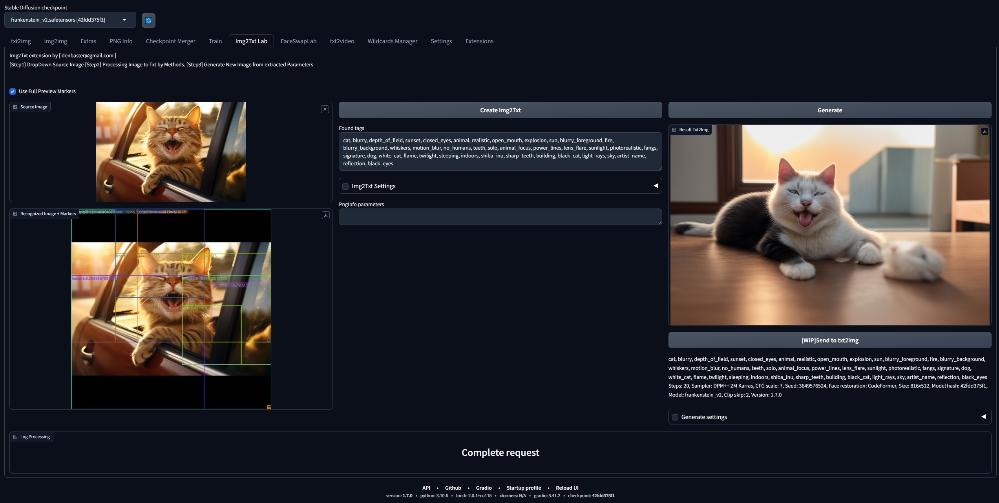
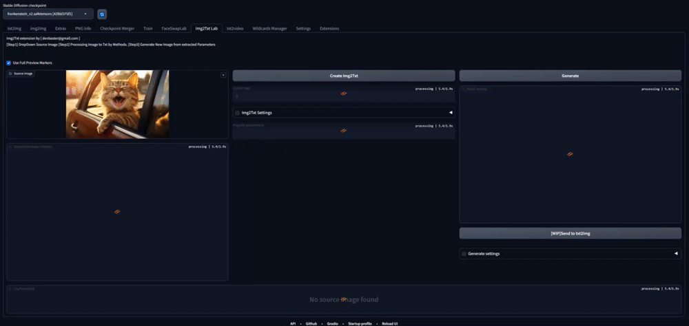

# stable-diffusion-webui-img2txt
"Source Image" Processing to "Generative Image" by StableDiffusuion txt2img.

Using SourceImage Info for new generation:
1)Accamulate Recognition Info.
2)Using PngInfo if exist.

To Do: improving features 

* Version 1.4 Improve pipelines
* Version 1.3 Recode and Redesign for Img2Txt extension by denbaster@gmail.com

based on deepdanbooru-object-recognition
Using this script you can interrogate Deepdanboru and identify objects in the images
* Add alternative detection method using CNN Kernel approach
* Add multiple object detection
* Add request folder uuid
* Preservate original size on detection
Version 1.1
* Add UI
* Add initial method using region identifier
Version 1.0
* Add initial commit and create repository
